# EV Adoption Extension Mechanics

As implemented (see `EV_MODEL_DESCRIPTION.md` for the full description).
Dashed mechanisms are optional switches, all off by default.

```mermaid
flowchart LR
    subgraph Base["Base Mesa Affordance Model (unchanged)"]
        A["Affordance grid\npro / non environmental opportunities"]
        B["ConsumerAgent\npro_env and non_env states"]
        C["Behaviour loop\nmove through landscape, act, learn"]
        A --> C
        B --> C
        C --> B
    end

    subgraph EV["EV Adoption Extension"]
        F["EVConsumerAgent\nincome, mileage, vehicle age,\ntraits; fixed home_pos\n(movement stays abstract)"]
        G["Charging access layer\nnearest-charger distance decay\nat home_pos"]
        G2["Congestion (optional)\nlocal capacity vs adopter demand\ndiscounts effective access"]
        H["TCO mechanism\neffective EV price - subsidy vs ICE;\nfuel, electricity, maintenance"]
        H2["Price learning (optional)\nEV price declines with adoption,\nfloored"]
        I["Scenario presets\ncolleague_baseline, no_policy,\nsubsidy, fuel_price,\ncharging_expansion"]
        J["Peer exposure\nnetwork neighbours or\nresidential Moore homes"]
        J2["Social diffusion (optional)\npeer share lowers range anxiety,\nraises environmental concern"]
        K["Replacement trigger\nvehicle_age >= replacement_interval"]
        L["Adoption score\neconomic + charging + environmental\n+ peer - range anxiety"]
        L2["Decision rule\ndeterministic threshold (default)\nor logistic probability"]
        M2["Supply gate (optional)\nat most ev_supply_per_step\npurchases; blocked agents retry"]
        M["EV adoption state\nev_adopted; initial_ev_share\nseeds t=0 market"]
        X["Charging expansion\nexogenous rate (default) or\ndemand-driven siting near\nadopter homes"]
    end

    B -. "subclass" .-> F
    I --> H
    I --> X
    F --> H
    F --> L
    G --> G2
    G2 --> L
    H --> L
    J --> L
    K --> L
    L --> L2
    L2 --> M2
    M2 --> M
    M --> J
    J -.-> J2
    J2 -.-> F
    M -. "adoption share" .-> H2
    H2 -.-> H
    M -. "demand mode:\nadoption drives siting" .-> X
    X --> G
    M -. "adopter homes\ncongest chargers" .-> G2

    subgraph Outputs["Model Outputs (DataCollector)"]
        N["EV adoption share / count"]
        O["Decision-component means\n(economic, charging, environmental,\npeer, range anxiety, TCO)"]
        P["Charging coverage, congestion,\neffective price, supply blocked"]
        R["Original pro / non\nbehaviour shares"]
    end

    M --> N
    L --> O
    G2 --> P
    C --> R
```

Two coupled feedback loops when the optional mechanisms are enabled:

- **Reinforcing**: adoption → demand-driven charger siting → better access →
  higher adoption (plus price learning and social diffusion amplifying it).
- **Balancing**: adoption → local charger congestion → lower effective
  access → dampened adoption.
