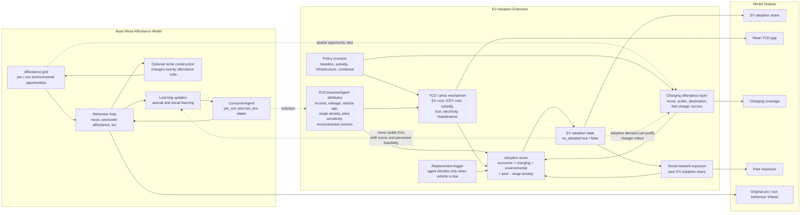

# EV Adoption Extension Mechanics

```mermaid
flowchart LR
    subgraph Base["Base Mesa Affordance Model"]
        A["Affordance grid\npro / non environmental opportunities"]
        B["ConsumerAgent\npro_env and non_env states"]
        C["Behaviour loop\nmove, encounter affordance, act"]
        D["Learning updates\nasocial and social learning"]
        E["Optional niche construction\nchanges nearby affordance cells"]
        A --> C
        B --> C
        C --> D
        D --> B
        C --> E
        E --> A
    end

    subgraph EV["EV Adoption Extension"]
        F["EVConsumerAgent attributes\nincome, mileage, vehicle age,\nrange anxiety, price sensitivity,\nenvironmental concern"]
        G["Charging affordance layer\nhome, public, destination,\nfast charger access"]
        H["TCO / price mechanism\nEV cost, ICEV cost, subsidy,\nfuel, electricity, maintenance"]
        I["Policy scenario\nbaseline, subsidy, infrastructure, combined"]
        J["Social network exposure\npeer EV adoption share"]
        K["Replacement trigger\nagent decides only when vehicle is due"]
        L["Adoption score\neconomic + charging + environmental\n+ peer - range anxiety"]
        M["EV adoption state\nev_adopted true / false"]
    end

    B -. "subclass" .-> F
    A -. "spatial opportunity idea" .-> G
    I --> H
    I --> G
    F --> H
    F --> L
    G --> L
    H --> L
    J --> L
    K --> L
    L --> M
    M --> J
    M -. "more visible EVs\nshift norms and perceived feasibility" .-> D
    M -. "adoption demand can justify\ncharger rollout" .-> G

    subgraph Outputs["Model Outputs"]
        N["EV adoption share"]
        O["Mean TCO gap"]
        P["Charging coverage"]
        Q["Peer exposure"]
        R["Original pro / non behaviour shares"]
    end

    M --> N
    H --> O
    G --> P
    J --> Q
    C --> R
```
